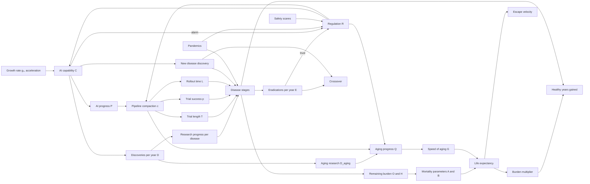

# The Last Disease

**How long until AI cures everything?**

The Last Disease is a zero-player simulation. You choose how AI grows, then watch decades of medical research, clinical trials, pandemics, breakthroughs, regulation, and aging research play out year by year. The run reaches its **crossover** when diseases are being eradicated faster than new ones are discovered, and you can keep going until every disease is gone.

This README explains how the app works and documents every mathematical relationship in the model, with links to the established models it builds on. Each relationship is marked as either **established** (standard mathematics, demography, or public health methods) or a **model assumption** (a choice this simulation makes).

> Figures are rough, order-of-magnitude estimates. Treat results as a way to explore which levers matter most, not as forecasts.

---

## Contents

- [How it works](#how-it-works)
- [Getting started](#getting-started)
- [Project structure](#project-structure)
- [The model at a glance](#the-model-at-a-glance)
- [Symbols and variables](#symbols-and-variables)
- [1. Randomness and reproducibility](#1-randomness-and-reproducibility)
- [2. The disease world](#2-the-disease-world)
- [3. AI capability](#3-ai-capability)
- [4. Regulation](#4-regulation)
- [5. The research pipeline](#5-the-research-pipeline)
- [6. Discovering new diseases](#6-discovering-new-diseases)
- [7. Random events](#7-random-events)
- [8. Disease burden and healthy years](#8-disease-burden-and-healthy-years)
- [9. Life expectancy: the Gompertz–Makeham life table](#9-life-expectancy-the-gompertzmakeham-life-table)
- [10. Milestones and end conditions](#10-milestones-and-end-conditions)
- [11. Visualization math](#11-visualization-math)
- [12. Batch runs and statistics](#12-batch-runs-and-statistics)
- [Parameters](#parameters)
- [Established models vs. model assumptions](#established-models-vs-model-assumptions)
- [Verification](#verification)
- [References](#references)

---

## How it works

1. **Pick a growth shape.** AI research capability either compounds exponentially every year, or compounds with multi-year plateaus that new breakthroughs eventually break. Everything else is adjustable in Settings.
2. **The world starts in 2026** with 17,000 known diseases, an estimated 25,000 not yet discovered, and today's research pipeline.
3. **Each simulated year**, AI capability grows, research discoveries flow to diseases, candidates move through trials and global rollout, new diseases are found, random events strike, regulation shifts, and life expectancy is recalculated from mortality risk.
4. **The crossover** ends the run by default. You can choose to keep going to full eradication, which is where life expectancy approaches its maximum of about 500 years.
5. **Save and share** replays a run exactly from its settings and seed. The **Explore** page runs hundreds of seeds and shows the distribution of outcomes.

---

## Getting started

```bash
pnpm install
pnpm dev          # runs the web app and API together
pnpm test         # engine, API, and calibration tests
```

Environment variables for the API: `DATABASE_URL`, `PORT` (default 8787), `PUBLIC_BASE_URL` (used in share links), and `BATCH_MAX_CONCURRENT` (default 2).

---

## Project structure

```
the-last-disease/
  packages/engine/   Deterministic simulation engine (pure TypeScript, no dependencies)
  apps/web/          React front end: canvas charts, controls, settings, modals
  apps/api/          Fastify API: saved runs, share links, batch (Monte Carlo) jobs
```

The engine runs identically in the browser and on the server. The front end calls `simulate(params)` once at the start of a run, then animates the precomputed history year by year. The server replays runs from `{params, seed}` and never trusts results sent by the browser.

---

## The model at a glance

Arrows point from a variable to the variables it affects.



---

## Symbols and variables

| Symbol  | Meaning                                                      | Unit or range                   |
| ------- | ------------------------------------------------------------ | ------------------------------- |
| t       | Years since 2026                                             | years                           |
| u       | A fresh uniform random draw                                  | 0 to 1                          |
| z       | A fresh standard normal random draw                          | N(0, 1)                         |
| C       | AI research capability relative to 2026                      | multiple of today (starts at 1) |
| g       | AI growth rate this year                                     | fraction per year               |
| R       | Regulation, from laissez-faire to strict                     | 0 to 1                          |
| P       | AI progress index, ln C / ln 10,000                          | 0 at today, 1 at 10,000×        |
| c       | Pipeline compaction                                          | 0 to 1                          |
| T       | Clinical trial length                                        | years                           |
| p       | Trial success probability                                    | 0.1 to 0.9                      |
| L       | Global rollout time                                          | years                           |
| D       | Research discoveries per year for diseases                   | discoveries                     |
| D_aging | Research discoveries per year for aging                      | discoveries                     |
| E       | Diseases eradicated this year                                | count                           |
| newF    | New diseases found this year                                 | count                           |
| rem     | Diseases remaining (research, trials, rollout)               | count                           |
| b_i     | Burden of disease i                                          | DALYs per year                  |
| O, H    | Remaining burden of age-independent and age-related diseases | DALYs per year                  |
| A, B, G | Gompertz–Makeham parameters                                  | per year                        |
| LE      | Period life expectancy at birth                              | years                           |
| LE_dis  | Life expectancy with aging untouched                         | years                           |
| dAg     | Change in years added by aging research                      | years per year                  |

---

## 1. Randomness and reproducibility

**Established.** Every random number comes from one seeded generator, so the same settings and seed always produce the same run, in the browser and on the server.

- **Generator:** [Mulberry32](https://gist.github.com/tommyettinger/46a874533244883189143505d203312c), a 32-bit [pseudorandom number generator](https://en.wikipedia.org/wiki/Pseudorandom_number_generator) ([reference implementations](https://github.com/bryc/code/blob/master/jshash/PRNGs.md)). A seed of 0 picks a random seed from 1 to 1,000,000 and records it.
- **Normal draws:** the [Box–Muller transform](https://en.wikipedia.org/wiki/Box%E2%80%93Muller_transform):

```math
z = \sqrt{-2 \ln u_1}\,\cos(2\pi u_2)
```

- **Shuffling:** the [Fisher–Yates shuffle](https://en.wikipedia.org/wiki/Fisher%E2%80%93Yates_shuffle) for display order.
- **Sampling without replacement:** pick index ⌊u × n⌋, then swap-remove it.
- **Weighted picks:** [fitness proportionate (roulette wheel) selection](https://en.wikipedia.org/wiki/Fitness_proportionate_selection), where probability is proportional to weight.

The order of random draws is part of the model. Changing it changes every run.

---

## 2. The disease world

Each of about 42,150 diseases is tracked individually: 17,000 known in 2026, a pool of undiscovered diseases (25,000 by default), and 150 reserve slots for future pandemics.

### Stages

Each disease is always in one of five stages:

```math
\text{undiscovered} \rightarrow \text{research} \rightarrow \text{clinical trials} \rightarrow \text{global rollout} \rightarrow \text{eradicated}
```

### Disease types

**Model assumption,** anchored to a total burden of 2.5 billion DALYs per year, the order of magnitude reported by the [Global Burden of Disease study](https://vizhub.healthdata.org/gbd-results/) ([summary data](https://ourworldindata.org/grapher/total-disease-burden)).

| Type             | Known in 2026 | Share of undiscovered | Share of burden | Median difficulty |
| ---------------- | ------------- | --------------------- | --------------- | ----------------- |
| Infectious       | 2,500         | 10%                   | 25%             | 7                 |
| Genetic and rare | 8,000         | 80%                   | 3%              | 9                 |
| Chronic          | 3,000         | 0%                    | 55%             | 28                |
| Neuro and mental | 1,500         | 0%                    | 12%             | 40                |
| Autoimmune       | 700           | 0%                    | 2%              | 22                |
| Other            | 1,300         | 10%                   | 3%              | 12                |

These types contain 24 disease families, each with one platform technology (for example, in-vivo base editing for metabolic disorders). The 33 highest-profile diseases, such as ischemic heart disease, malaria, and Alzheimer's disease, are named and appear in the event log.

### Burden follows Zipf's law

A few diseases carry most of the burden. Within each type, burden follows a [Zipf-like power law](https://en.wikipedia.org/wiki/Zipf%27s_law) with some randomness (**established pattern, model parameters**):

```math
w_i = \frac{0.5 + u_i}{(i+1)^{1.15}}, \qquad b_i = \max\left(50,\ R_{type} \cdot \frac{w_i}{\sum_j w_j}\right)
```

R_type is the type's share of 2.5 billion DALYs, minus the burden already assigned to named diseases in that type.

### Difficulty is log-normal

The number of discoveries a disease needs before it can enter trials follows a [log-normal distribution](https://en.wikipedia.org/wiki/Log-normal_distribution) around the type's median m:

```math
\text{diff}_i = \max\left(1,\ m \cdot e^{1.0\,z}\right)
```

Undiscovered diseases are easier (0.8m, with spread 0.7) and small (burden 2000 × e^(1.2z)), since most are rare genetic conditions.

### Head start

Research is already underway in 2026. Each known disease starts with progress 0.85 × diff × u^1.5. About 3% start in trials and 0.6% in rollout. Measles starts in rollout because it is close to eradication already.

---

## 3. AI capability

### Exponential growth

**Established math, model parameters.** AI capability follows [exponential growth](https://en.wikipedia.org/wiki/Exponential_growth) with a rate that itself compounds (acceleration) and is scaled by regulation:

```math
g_t = \frac{g_0}{100}\left(1 + \frac{acc}{100}\right)^{t} M(R), \qquad C_{t+1} = C_t\,(1 + g_t)
```

Equivalently, ln C grows by ln(1 + g) each year, which is why AI capability is a straight line on a log scale.

### Regulation's effect on growth

**Model assumption.** Balanced regulation (R = 0.5) leaves growth unchanged. Strict rules can cut it to about a third; hands-off rules add up to a quarter:

```math
M(R) = \begin{cases} 1.25 - 0.5R & R < 0.5 \\ 1 - 1.3(R - 0.5) & R \ge 0.5 \end{cases}
```

### Plateaus and breakthroughs

**Model assumption.** With plateaus on, capability grows exponentially until it hits a ceiling K (first at 100× today). It then stalls for a random number of years:

```math
\text{plateau length} = \max\left(1,\ \text{round}\left(\ell\,(0.5 + u)\right)\right)
```

where ℓ is the typical plateau length (5 years by default). During a plateau, capability creeps up at only 3% of the normal rate. When the plateau ends, a breakthrough sets the next ceiling 10 to 100 times higher:

```math
K_{next} = C \cdot 10^{\,1 + u}
```

### AI progress index

```math
P = \frac{\ln C}{\ln 10{,}000}
```

P is 0 today and 1 when AI is 10,000× more capable. It drives the pipeline speed-up and event probabilities.

---

## 4. Regulation

**Model assumption,** structured as a discrete [mean-reverting process](https://en.wikipedia.org/wiki/Ornstein%E2%80%93Uhlenbeck_process) with random drift and feedback from AI and cures:

```math
R \leftarrow \mathrm{clamp}_{[0,1]}\left(R + 0.068\,\frac{vol}{100}(2u - 1) + 0.06\left(\frac{reg_0}{100} - R\right) + alarm - trust\right)
```

- **Mean reversion:** each year, regulation moves 6% of the way back toward the starting climate reg₀.
- **Random drift:** political volatility vol sets the size of random swings.
- **Alarm:** fast AI growth tightens rules.

```math
alarm = \max\left(-0.02,\ 0.07\left(\ln\frac{C_t}{C_{t-1}} - 0.33\right)\right)
```

- **Trust:** last year's eradications loosen rules.

```math
trust = 0.03 \cdot \min\left(1,\ \frac{E_{t-1}}{400}\right)
```

- **Events:** a pandemic loosens rules by 0.2 (emergency authorization), and a safety scare tightens them by 0.18.

Regulation and AI are linked in both directions: strict rules slow AI, and fast AI growth pushes rules tighter.

---

## 5. The research pipeline

### Pipeline speed

**Model assumption,** starting from roughly today's values: trials take about 8 years, and about 90% of drugs entering human trials fail ([drug development](https://en.wikipedia.org/wiki/Drug_development), [phases of clinical research](https://en.wikipedia.org/wiki/Phases_of_clinical_research)). AI progress compresses all three pipeline stages through a saturating compaction factor, slowed by strict regulation:

```math
c = 1 - e^{-2.2\,\max(0,P)\,(1 - 0.7R)}
```

```math
T = 0.4 + 7.6(1 - c), \qquad p = 0.1 + 0.8c, \qquad L = 1 + 7(1 - c)
```

At full compaction, trials take 0.4 years, 90% succeed, and rollout takes 1 year.

### Research capacity

A pandemic diverts 30% of research for 2 years (div = 0.7, otherwise 1):

```math
AI = aiBase \cdot C \cdot div, \qquad D_{aging} = AI \cdot \frac{aging}{100}, \qquad D = human \cdot div + AI\left(1 - \frac{aging}{100}\right)
```

### Where research goes

Discoveries are split among diseases in research in proportion to a weight. **Model assumption:** the exponent γ shrinks as AI gets cheaper, so neglected diseases get a bigger share over time.

```math
W_i = (b_i + 1)^{\gamma}\cdot k_{type}, \qquad \Delta\text{prog}_i = D_d \cdot \frac{W_i}{\sum_j W_j}\,(0.6 + 0.8u)
```

| Research priority               | γ                | Type multipliers k                                                     | Effective discoveries D_d |
| ------------------------------- | ---------------- | ---------------------------------------------------------------------- | ------------------------- |
| Biggest killers first (default) | 0.8 / (1 + 0.4P) | all 1                                                                  | D                         |
| Neglected and rare              | 0                | Genetic 4, Autoimmune and Other 2, Chronic and Neuro 0.6, Infectious 1 | D                         |
| Platform technology             | 0.5 / (1 + P)    | all 1                                                                  | 0.7D                      |
| Aging first                     | 0.5 / (1 + P)    | all 1                                                                  | D                         |

Under the rare priority, genetic diseases also get basket trials: half the trial length and +0.15 success probability.

### Moving through the stages

- **Research → trials** when prog ≥ diff. Trial length is T × (0.7 + 0.6u).
- **Trials → rollout** with probability p. A failed trial sends the disease back to research at half its required progress. Because each attempt is an independent success-or-failure trial, the number of attempts follows a [geometric distribution](https://en.wikipedia.org/wiki/Geometric_distribution) with an expected 1/p attempts.
- **Rollout → eradicated** after L × (0.7 + 0.6u) years.
- **Resistance:** each year in rollout, an infectious disease reverts to research (at 60% progress) with probability (res / 100)(1 − 0.6c).

---

## 6. Discovering new diseases

**Model assumption.** Detection grows as a [power law](https://en.wikipedia.org/wiki/Power_law) of AI capability and slows as the undiscovered pool empties:

```math
\text{found per year} = newBase \cdot C^{\beta/100} \cdot \frac{poolLeft}{pool}
```

Fractional amounts accumulate, and whole diseases are drawn from the pool without replacement. β = 0 means AI does not help find diseases; β = 100 means discovery keeps pace with AI.

---

## 7. Random events

Each event is a yearly [Bernoulli trial](https://en.wikipedia.org/wiki/Bernoulli_trial) with the probability shown. **Model assumptions.**

| Event                 | Probability per year                                                          | Effect                                                                                                          |
| --------------------- | ----------------------------------------------------------------------------- | --------------------------------------------------------------------------------------------------------------- |
| Pandemic              | pand / 100                                                                    | A new infectious disease with burden (5 + 75u₁u₂) million DALYs; research diverted for 2 years; regulation −0.2 |
| Safety scare          | 0.25(1 − R) · min(1, P)                                                       | Up to 40 therapies in rollout return to trials; regulation +0.18                                                |
| Platform breakthrough | (spill / 100) · min(0.85, m(0.04 + 0.12P)), m = 3 under the platform priority | Every disease in one family gains 70% (or 90%) of its required progress                                         |
| Surprise breakthrough | (surprise / 100) · 0.2                                                        | Half the time, a disease is fast-tracked into trials; otherwise AI capability jumps 30% (not during a plateau)  |

---

## 8. Disease burden and healthy years

**Established measure:** [disability-adjusted life years (DALYs)](https://en.wikipedia.org/wiki/Disability-adjusted_life_year), which count years lost to early death and to living with illness.

Longer lives raise the burden of age-related diseases (chronic and neuro), unless aging itself is being slowed. **Model assumption:**

```math
m_{age} = 1 + 0.03\,\max(0,\ LE - 73.3 - agingGain)\cdot\max\left(0,\ 1 - \frac{agingGain}{10}\right)
```

Total and averted burden, where rollout counts half and eradication counts fully:

```math
B_{tot} = \sum_{stage \ge 1} b_i m_i, \qquad B_{avert} = \sum_{rollout} 0.5\,b_i m_i + \sum_{eradicated} b_i m_i
```

**Healthy years gained** is the running total of B_avert across all years.

---

## 9. Life expectancy: the Gompertz–Makeham life table

This is the part of the model that produces a maximum life expectancy of about 500 years.

### The mortality law

**Established.** The [Gompertz–Makeham law of mortality](https://en.wikipedia.org/wiki/Gompertz%E2%80%93Makeham_law_of_mortality) describes the risk of dying at age a (the [hazard rate](https://en.wikipedia.org/wiki/Survival_analysis)) as a constant risk plus a risk that grows exponentially with age:

```math
\mu(a) = A + B\,e^{G a}
```

- **A (Makeham term):** risk that does not depend on age, such as accidents and infections.
- **B:** baseline frailty from age-related disease.
- **G:** the speed of aging. Today's value, G₀ = 0.085, means mortality doubles about every ln 2 / 0.085 ≈ 8.2 years, in line with observed human mortality.

### From mortality to life expectancy

**Established.** Life expectancy comes from a period [life table](https://en.wikipedia.org/wiki/Life_table): the [survival function](https://en.wikipedia.org/wiki/Survival_function) S(a) is the chance of living to age a, and life expectancy at birth is the total expected years lived. The engine uses yearly steps (a [Riemann sum](https://en.wikipedia.org/wiki/Riemann_sum)), evaluating risk at the middle of each year and stopping when survival drops below 1 in 10 million:

```math
S(0) = 1, \qquad S(a+1) = \exp\left(-\sum_{k=0}^{a}\mu(k + 0.5)\right), \qquad LE = \sum_{a=0}^{a_{max}} S(a)
```

This is period life expectancy: the lifespan of a person who experiences this year's mortality at every age.

### What the simulation changes year by year

The formula stays the same; only its parameters change each year, which is standard practice in [mortality forecasting](https://en.wikipedia.org/wiki/Lee%E2%80%93Carter_model).

**Diseases move A and B.** This simplifies established cause-elimination analysis by grouping diseases into age-independent ones (O) and age-related ones (H). **Model assumption:**

```math
A(t) = A_{ext} + A_{dis}\,\frac{O(t)}{O_0}, \qquad B(t) = B_{int}\left(1 + d\,\frac{H(t)}{H_0}\right)
```

- O(t): remaining burden of infectious, genetic, autoimmune, and other diseases.
- H(t): remaining burden of chronic and neuro diseases.
- Both use raw DALYs, count a disease fully in research or trials, half in rollout, and zero once eradicated. O₀ and H₀ are the 2026 values. Pandemics add to O, so they show up as dips in life expectancy.

**Aging research moves G. Model assumption,** since no established model links research effort to aging speed:

```math
Q_t = Q_{t-1} + \log_{10}(1 + D_{aging})\,(0.2 + 0.8c)\,(1 - 0.5R)
```

```math
G(t) = G_{min} + (G_0 - G_{min})\,e^{-Q_t / q_0}
```

- The logarithm gives diminishing returns: each tenfold increase in aging research adds the same progress.
- Aging therapies still need trials, so progress depends on the pipeline compaction c.
- Regulation slows aging research by up to half, because aging is not classified as a disease.
- q₀ (default 20) sets how hard aging research is.

**The maximum sets G_min. Model assumption:** aging can be slowed, but not stopped. G_min is solved so that, with every disease cured and aging at its slowest, life expectancy equals the maximum (500 by default). The solver is a geometric [bisection](https://en.wikipedia.org/wiki/Bisection_method) between 10⁻⁷ and G₀ with 80 iterations:

```math
LE(A_{ext},\ B_{int},\ G_{min}) = LE_{max} \quad\Rightarrow\quad G_{min} \approx 0.009405 \text{ for } 500 \text{ years}
```

That is about a 9× slowdown in aging. Without this floor, the established accident rate alone would allow roughly 1 / (A_ext + B_int) ≈ 1,600 years.

### Constants and calibration

| Constant | Value                             | Source                                                                  |
| -------- | --------------------------------- | ----------------------------------------------------------------------- |
| G₀       | 0.085                             | Established: observed human aging speed                                 |
| A_ext    | 0.0006 per year                   | Established: roughly 4.4 million injury deaths among 8.2 billion people |
| A_dis    | 0.004                             | Fitted                                                                  |
| B_int    | 1.9112359 × 10⁻⁵                  | Fitted                                                                  |
| d        | 0.2781289                         | Fitted                                                                  |
| G_min    | 0.009405 (for a 500-year maximum) | Solved                                                                  |
| q₀       | 20                                | Model assumption                                                        |

The fitted constants reproduce three anchors:

| Scenario                                  | A             | B            | G     | Life expectancy |
| ----------------------------------------- | ------------- | ------------ | ----- | --------------- |
| Today, 2026                               | A_ext + A_dis | B_int(1 + d) | G₀    | 73.3            |
| Every disease cured, aging untouched      | A_ext         | B_int        | G₀    | 90              |
| Every disease cured, aging at its slowest | A_ext         | B_int        | G_min | 500             |

Because the curve is steep, most of the gain comes late. With every disease cured, slowing aging by half gives about 147 years, by 75% about 222, by 90% about 328, by 95% about 395, and by 99% about 474.

### Years added by aging research

```math
LE_{dis} = LE(A, B, G_0), \qquad agingGain = LE - LE_{dis}, \qquad dAg_t = agingGain_t - agingGain_{t-1}
```

LE_dis is what life expectancy would be with only disease cures and no change to aging.

---

## 10. Milestones and end conditions

Milestones use a 3-year [moving average](https://en.wikipedia.org/wiki/Moving_average) to smooth out single-year noise.

- **[Longevity escape velocity](https://en.wikipedia.org/wiki/Longevity_escape_velocity):** the first year the 3-year average of dAg is at least 1, meaning aging research adds more than a year of life per year. The run continues.
- **Crossover:** the first year the 3-year average of eradications exceeds the 3-year average of new diseases found (and is above 0). The run ends here by default.
- **Full eradication:** no diseases remain in research, trials, or rollout, and the undiscovered pool is empty.
- **Time limit:** 2300.

### Stock-and-flow identities

The disease counts follow [stock-and-flow](https://en.wikipedia.org/wiki/Stock_and_flow) accounting exactly, every year:

```math
eradCum_t = eradCum_{t-1} + E_t
```

```math
rem_t = rem_{t-1} + newF_t - E_t
```

Resistance and safety scares only move diseases between research, trials, and rollout, so they never change the remaining count. Diseases remaining peaks in the year eradications first equal new discoveries; the crossover marker usually lands a year or two later because it uses the 3-year average.

---

## 11. Visualization math

### Main graph normalization

Each line is scaled to its own range across the full run, so shapes and timing are comparable and lines never rescale mid-animation:

```math
y = top + height \cdot \left(1 - \frac{f(v) - lo}{hi - lo}\right)
```

- f(v) = log₁₀(max(1, v)) for AI capability and discoveries per year, and f(v) = v for everything else.
- hi and lo come from the full precomputed run (`seriesBounds`), except fixed bounds: regulation and trial success from 0 to 1, life expectancy from 73, and others from 0.

### Supporting charts

- **The race:** new diseases and eradications per year, on a log₁₀(v + 1) scale so zero can be shown.
- **Longevity:** dAg on a linear scale, with a dashed line at 1 marking escape velocity.

### Large-number format

Values of 1,000 or more use thousand, million, billion, trillion, quadrillion, or quintillion, chosen by ⌊log₁₀(x) / 3⌋, with one decimal below 10 (for example, "6.4 thousand"). Beyond quintillion, values show as 10^N.

---

## 12. Batch runs and statistics

The Explore page is a [Monte Carlo](https://en.wikipedia.org/wiki/Monte_Carlo_method) analysis: it runs the same settings with seeds 1 through N and reports the distribution of outcomes, including crossover year [percentiles](https://en.wikipedia.org/wiki/Percentile) (10th, 25th, 50th, 75th, 90th), a histogram in 1-year bins, the share of runs reaching escape velocity and its median year, mean eradications, mean healthy years gained, and the share of runs that reach 2300.

---

## Parameters

Every parameter is adjustable in Settings and validated with the same ranges by the API. Settings changes apply to the next run.

| Group       | Key        | Setting                      | Default               | Range                                  |
| ----------- | ---------- | ---------------------------- | --------------------- | -------------------------------------- |
| AI progress | g0         | Model improvement rate       | 35% per year          | 5 to 150                               |
| AI progress | acc        | Acceleration                 | 1% per year           | 0 to 20                                |
| AI progress | growth     | Growth shape                 | Exponential           | Exponential, Exponential with plateaus |
| AI progress | ceiling    | First plateau                | 100× today            | 10× to 1,000,000×                      |
| AI progress | plen       | Typical plateau length       | 5 years               | 1 to 20                                |
| AI progress | aiBase     | AI discoveries in 2026       | 20 per year           | 5 to 200                               |
| AI progress | human      | Human baseline discoveries   | 50 per year           | 10 to 200                              |
| Regulation  | reg0       | Starting climate             | 50                    | 0 to 100                               |
| Regulation  | vol        | Political volatility         | 50%                   | 0 to 100                               |
| Diseases    | newBase    | New diseases found in 2026   | 200 per year          | 0 to 1,000                             |
| Diseases    | beta       | AI boost to finding diseases | 0.35                  | 0 to 1                                 |
| Diseases    | pool       | Undiscovered diseases        | 25,000                | 5,000 to 100,000                       |
| Diseases    | priority   | Research priority            | Biggest killers first | 4 options                              |
| Diseases    | res        | Resistance chance            | 4% per year           | 0 to 20                                |
| Events      | spill      | Platform breakthroughs       | 100% of normal        | 0 to 200                               |
| Events      | pand       | Pandemic chance              | 3% per year           | 0 to 20                                |
| Events      | surprise   | Surprise breakthroughs       | 100% of normal        | 0 to 200                               |
| Aging       | aging      | AI effort on aging           | 10% of AI research    | 0 to 50                                |
| Aging       | lemax      | Maximum life expectancy      | 500 years             | set in the engine                      |
| Aging       | q0         | Aging research difficulty    | 20                    | set in the engine                      |
| Ending      | endAtCross | Stop at the crossover        | on                    | on or off                              |
| Ending      | seed       | Run seed                     | 0 (random)            | integer ≥ 0                            |

---

## Established models vs. model assumptions

| Relationship                                            | Status                                                                |
| ------------------------------------------------------- | --------------------------------------------------------------------- |
| Gompertz–Makeham mortality law                          | Established                                                           |
| Life table and survival function for life expectancy    | Established                                                           |
| Today's aging speed (mortality doubling every ~8 years) | Established                                                           |
| Injury mortality floor                                  | Established (approximate)                                             |
| DALYs as the burden measure; 2.5 billion total          | Established measure, rounded total                                    |
| Zipf-like burden and log-normal difficulty              | Established distributions, model parameters                           |
| Exponential AI growth, acceleration, plateaus           | Model assumption                                                      |
| Regulation dynamics and its two-way link with AI        | Model assumption                                                      |
| Pipeline compaction, trial length, success, rollout     | Model assumption, anchored to today's ~8-year trials and ~10% success |
| Research allocation weights and priorities              | Model assumption                                                      |
| Disease detection power law                             | Model assumption                                                      |
| Event probabilities and effects                         | Model assumption                                                      |
| Diseases grouped into A and B                           | Simplified from established cause elimination                         |
| Aging research slows the speed of aging                 | Model assumption                                                      |
| Aging can only be slowed ~9× (500-year maximum)         | Model assumption                                                      |
| Burden multiplier from population aging                 | Model assumption                                                      |
| Escape velocity measured with period life expectancy    | Established concept, model measurement                                |

---

## Verification

The engine is deterministic, so a fixed seed must always give the same result.

**Golden run** (default settings, seed 12345):

| Check                                            | Expected                            |
| ------------------------------------------------ | ----------------------------------- |
| Crossover year                                   | 2054                                |
| Escape velocity year                             | 2033                                |
| Eradicated at crossover                          | 6,092                               |
| Remaining at crossover                           | 33,942                              |
| Healthy years gained at crossover                | 21,453,310,019                      |
| Life expectancy at crossover                     | 257.175 years                       |
| Pandemics, platform breakthroughs, safety scares | 5, 3, 5                             |
| Full eradication (keep going)                    | 2080, life expectancy 498.365 years |

**Invariant tests** check, for every simulated year, that the two stock-and-flow identities hold, stage counts add up to the total number of diseases, regulation stays between 0 and 1, and trial values stay within their bounds. Across 20 seeds for each growth shape, life expectancy at full eradication lands between 490 and 500 years and never exceeds 500.

---

## References

**Demography and mortality**

- [Gompertz–Makeham law of mortality](https://en.wikipedia.org/wiki/Gompertz%E2%80%93Makeham_law_of_mortality)
- [Life table](https://en.wikipedia.org/wiki/Life_table)
- [Survival function](https://en.wikipedia.org/wiki/Survival_function)
- [Survival analysis and hazard rates](https://en.wikipedia.org/wiki/Survival_analysis)
- [Lee–Carter model (time-varying mortality forecasting)](https://en.wikipedia.org/wiki/Lee%E2%80%93Carter_model)
- [Longevity escape velocity](https://en.wikipedia.org/wiki/Longevity_escape_velocity)

**Public health data**

- [Disability-adjusted life year (DALY)](https://en.wikipedia.org/wiki/Disability-adjusted_life_year)
- [Global Burden of Disease results tool (IHME)](https://vizhub.healthdata.org/gbd-results/)
- [Total disease burden (Our World in Data)](https://ourworldindata.org/grapher/total-disease-burden)
- [Drug development](https://en.wikipedia.org/wiki/Drug_development)
- [Phases of clinical research](https://en.wikipedia.org/wiki/Phases_of_clinical_research)

**Mathematics and statistics**

- [Exponential growth](https://en.wikipedia.org/wiki/Exponential_growth)
- [Power law](https://en.wikipedia.org/wiki/Power_law)
- [Zipf's law](https://en.wikipedia.org/wiki/Zipf%27s_law)
- [Log-normal distribution](https://en.wikipedia.org/wiki/Log-normal_distribution)
- [Bernoulli trial](https://en.wikipedia.org/wiki/Bernoulli_trial)
- [Geometric distribution](https://en.wikipedia.org/wiki/Geometric_distribution)
- [Ornstein–Uhlenbeck process (mean reversion)](https://en.wikipedia.org/wiki/Ornstein%E2%80%93Uhlenbeck_process)
- [Stock and flow](https://en.wikipedia.org/wiki/Stock_and_flow)
- [Moving average](https://en.wikipedia.org/wiki/Moving_average)
- [Riemann sum](https://en.wikipedia.org/wiki/Riemann_sum)
- [Bisection method](https://en.wikipedia.org/wiki/Bisection_method)
- [Monte Carlo method](https://en.wikipedia.org/wiki/Monte_Carlo_method)
- [Percentile](https://en.wikipedia.org/wiki/Percentile)

**Randomness**

- [Pseudorandom number generator](https://en.wikipedia.org/wiki/Pseudorandom_number_generator)
- [Mulberry32 (original by Tommy Ettinger)](https://gist.github.com/tommyettinger/46a874533244883189143505d203312c)
- [Collection of JavaScript PRNGs, including Mulberry32 (bryc)](https://github.com/bryc/code/blob/master/jshash/PRNGs.md)
- [Box–Muller transform](https://en.wikipedia.org/wiki/Box%E2%80%93Muller_transform)
- [Fisher–Yates shuffle](https://en.wikipedia.org/wiki/Fisher%E2%80%93Yates_shuffle)
- [Fitness proportionate selection](https://en.wikipedia.org/wiki/Fitness_proportionate_selection)
